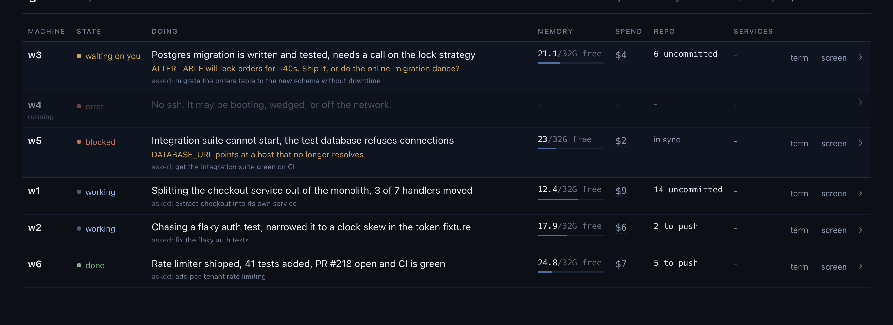

# agentfleet

Run a fleet of coding agents on remote machines, and see from one screen what
every one of them is doing and which are blocked on you.



## The problem

Ten agents working in parallel is not ten times the throughput if finding the
one that stopped means attaching to ten terminals in turn. The state you need is
never in the same place either: a permission prompt and an expired login are
drawn on the tmux screen and never written to disk, while the actual work is in
a transcript file, and "it finished its turn" is not the same as "it is done"
when three background shells and two subagents are still running. So the failure
mode is not a crashed machine, it is a machine that has been quietly waiting for
an answer for forty minutes while you watched a different one.

agentfleet is the control plane for that. Each machine computes its own status
locally on a timer and writes a small JSON file; your laptop reads those files
and prints one line per machine, sorted so the ones that need you are at the
top. Provisioning, config sync and per-machine token spend come along because
you cannot run the fleet without them.

## Quickstart

This path uses the `ssh` provider: you bring machines you already have, and no
cloud account is involved.

```sh
git clone https://github.com/beknazar/agentfleet
cd agentfleet
./install.sh                            # symlinks ./agentfleet into a bin dir on your PATH
export PATH="$HOME/.local/bin:$PATH"    # only if install.sh says so; it also adds this to your shell rc
agentfleet init                         # writes the config, generates ~/.ssh/agentfleet
```

Open `~/.config/agentfleet/config` and edit two lines:

```sh
AF_HOSTS="w1 w2 w3"   # your machines, by any name ssh can resolve
AF_USER=ubuntu        # the login user on them
```

The names in `AF_HOSTS` are used verbatim as ssh destinations, so they must
resolve on their own: a real DNS name, a tailnet name, an `/etc/hosts` entry, or
a `Host` block already in your `~/.ssh/config` (agentfleet detects a name you
declared there and leaves your block alone).

Let the generated key in, once per machine, then build them:

```sh
ssh-copy-id -i ~/.ssh/agentfleet.pub ubuntu@w1
agentfleet provision all
agentfleet ls
```

```
HOST       STATE       DOING                                    MEM              TODAY
w1         waiting     asked whether to run the migration       9.4/32G          $4.18
w2         working     rewriting the retry loop in worker.ts    14.1/32G         $9.02
w3         idle        -                                        30.2/32G         $0.00
need you: w1
```

Two things worth knowing before the first run. Provisioning installs Tailscale on
each machine and prefers a tailnet address over the provider's, because an
address that survives you changing networks is the difference between a fleet and
a fleet you cannot reach; set `AF_TAILNET=off` if you do not want that. And the
machines must be Debian or Ubuntu with passwordless sudo for `AF_USER` -
provisioning installs packages, a swapfile and systemd user units.

From here:

```sh
agentfleet say w1 "yes, run it"        # type into the live session
agentfleet run w2 "fix the flaky test" # detached job in its own tmux session
agentfleet attach w2                   # drop into the machine's tmux
agentfleet sync all                    # push your agent config to every machine
agentfleet dash                        # the same view as a web page
```

## What you get

**`agentfleet ls`** probes every machine in parallel, with a hard per-machine
timeout, and prints one line each: state, what it is doing or what it needs from
you, free memory, today's spend. Rows are ordered needs-you, unreachable, low
memory, working, quiet. One wedged machine cannot decide how long the table takes,
and an unreachable one prints `?` for memory and spend rather than zero, because
a zero reads as a healthy idle machine.

**The dashboard** (`agentfleet dash`) is the same data as a page, plus a drawer
per machine with the recent conversation, and buttons: send a message to the live
session, start a new detached run, interrupt, clear context, sync, reprovision,
restart the browser, start or stop the machine. It is password-protected, runs on
your laptop because that is where the ssh key and the tailnet are, and binds to
your tailnet address by default so it opens on your phone. Deleting a machine is
deliberately not a button.

**`say` and `run`** are two different things. `say` types into the session that
is already running, so you can answer a question or redirect a run in flight.
`run` starts a detached job in its own tmux session with its own log, and refuses
to reuse a session name that is already taken rather than typing one job's prompt
into another job's agent.

**`sync`** moves your agent's configuration out and the machines' work back, over
three deliberately separate channels: `AF_SYNC_PATHS` goes out by rsync one way
(the laptop is the source of truth), `AF_REPO` moves both ways through your own
git remote, and credentials go only through `agentfleet secrets push`, which is
explicit and asks first. A machine checked out on a branch other than
`AF_REPO_BRANCH` is skipped and left alone. Conflicts block and are named by file;
nothing is stashed, merged, reset or force-pushed.

**Cost** is per machine and per day: `agent/af-cost.py` reads the token counts the
agent CLIs already write into their own transcripts, prices them, buckets by local
day, and writes a small JSON file that `ls` and the dashboard read, on its own
five-minute timer. It is an estimate from a static price table, marked as one in
its output, and you can point `AF_COST_PRICES` at your own rates.

## Requirements

**On your laptop:** bash (3.2 is fine, so the macOS default works), `ssh`, `scp`,
`rsync`. `jq` for `agentfleet ls`, and Node 18 or newer for `agentfleet dash` (the
dashboard has zero npm dependencies and no build step). Optional: `tailscale`,
the `az` CLI for the azure provider, and `pngpaste` for `agentfleet drop -c` on
macOS.

**On the machines:** Debian or Ubuntu with `apt`, passwordless sudo for the login
user, your ssh key in its `authorized_keys`, systemd with a user bus, and `curl`.
Provisioning installs the rest: tmux, git, jq, rsync, unzip, ripgrep, python3,
build-essential and ttyd from apt; Node via nvm; and your agent CLI (Claude Code
or Codex). It also adds a swapfile, earlyoom with a tuned kill preference, an
OOM-protection drop-in for sshd, and a fan-out cap computed from the machine's
RAM. That last group is not decoration: a coding agent that fans out hard enough
will take a machine into swapless thrash where sshd can no longer fork, and there
is then no way back in.

## Cloud machines

Set `AF_PROVIDER=azure` and agentfleet owns the machine lifecycle:

```sh
agentfleet up w1                  # create, provision, join the tailnet
agentfleet up w2 Standard_D16as_v5
agentfleet down w1                # deallocate: compute billing stops, disk kept
agentfleet start w1               # bring it back (the disk survived, so it comes back built)
agentfleet down w1 --delete       # destroy it (asks first)
agentfleet unlock                 # after changing networks: re-point the ssh
                                  # firewall rule at your current public IP
```

Machines are created from `providers/azure-cloud-init.yaml` with a static public
IP, a managed identity so nothing on the machine ever needs an interactive cloud
login, and an ssh firewall rule narrowed to your current egress IP. Creation
fails rather than leaving port 22 open to the internet if that IP cannot be
determined.

A provider is five shell functions. `providers/ssh.sh` is forty lines and is the
worked example; adding Hetzner, GCP or anything else is an afternoon. See
[docs/providers.md](docs/providers.md).

## Security

This tool holds an ssh key to machines that run a coding agent with broad
permissions, it can push credential files to them, and `agentfleet dash` serves a
web page where every authenticated request can type into a live agent session.
That port is remote code execution on every machine in the fleet with one password
in front of it, so it binds to your tailnet or to localhost and must not be bound
to `0.0.0.0`. The credential push (`AF_SECRETS`), the reverse browser tunnel
(`AF_MAC_CHROME`) and unattended auto-commit (`AF_AUTOCOMMIT`) are all off by
default and each one widens the trust model in a specific, describable way. Read
[docs/security.md](docs/security.md) before you turn any of them on; it says what
to do, not just what to worry about.

## Prior art, and what this is not

agentfleet is a control plane for agents you already run on machines you already
pay for. It is not a hosted service: there is no backend, no account, and nothing
leaves your laptop and your machines. It is not an agent framework and does not
care what your agent does - it starts Claude Code or Codex in tmux, reads what
they write, and gets out of the way. It is not a scheduler or a work queue; it
does not decide what runs where, you do.

The closest things are the terminal multiplexer session you were already keeping
by hand, a folder of ssh aliases, and the cloud console tab you check for
whether a box is still billing. It replaces those three with one table.

Everything is bash, one dependency-free Node file, and two Python files. Read it
before you run it; that is the point of it being this small.

## License

MIT. See [LICENSE](LICENSE).
